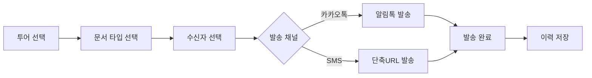
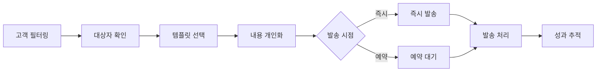
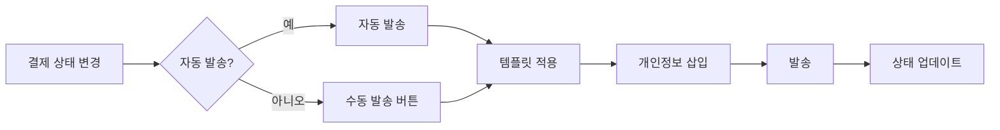

# 📍 메시지 발송 위치 설계서

## 🎯 발송 위치별 상세 설계

### 1. 📊 고객 데이터베이스 (대량 마케팅)

#### 위치: `/admin/customers`
```
┌─ 고객 데이터베이스 ────────────────────────┐
│ [엑셀 업로드] [내보내기] [+ 고객 추가]      │
│                                             │
│ ┌─────────────────────────────────┐         │
│ │ 📤 마케팅 발송                 ▼│         │
│ │ ├─ 📣 홍보 안내 (일정 중심)    │         │
│ │ ├─ 🎁 특별 프로모션 (혜택)     │         │
│ │ ├─ 📋 맞춤 메시지              │         │
│ │ └─ 📊 발송 이력 보기           │         │
│ └─────────────────────────────────┘         │
│                                             │
│ [필터 패널] ... 선택된 고객: 245명          │
└─────────────────────────────────────────────┘
```

**주요 기능**
- 다중 고객 선택 및 필터링
- 템플릿 기반 대량 발송
- 발송 이력 관리
- A/B 테스트 지원

### 2. 💰 견적 관리 (개별 발송)

#### 위치: `/admin/quotes`
```
┌─ 견적 관리 ─────────────────────────────────┐
│ 견적서 목록                                  │
├─────────────────────────────────────────────┤
│ No | 고객명 | 투어 | 금액 | 상태 | 액션    │
│────┼────────┼──────┼──────┼──────┼─────────│
│ 1  | 홍길동 | 부킬 | 120만| 대기 | [보기]  │
│    |        |      |      |      | [편집]  │
│    |        |      |      |      | [📤발송]│
└─────────────────────────────────────────────┘
```

**발송 옵션 모달**
```
[견적서 발송]
○ 카카오톡 (견적서 링크)
○ SMS (간단 안내)
○ 이메일 (PDF 첨부)

[취소] [발송]
```

### 3. 📣 홍보 페이지 관리

#### 위치: `/admin/promotions`
```
┌─ 홍보 페이지 ───────────────────────────────┐
│ ┌─────────────────┐ ┌─────────────────┐     │
│ │ 3월 베트남 특가 │ │ 4월 태국 얼리버드│    │
│ │                 │ │                 │     │
│ │ [편집][미리보기]│ │ [편집][미리보기]│     │
│ │ [복사][📤 발송] │ │ [복사][📤 발송] │     │
│ └─────────────────┘ └─────────────────┘     │
└─────────────────────────────────────────────┘
```

**홍보 발송 플로우**
1. 홍보 페이지 선택
2. 발송 대상 선택 (고객 DB 연동)
3. 채널 선택 (카카오/SMS/MMS)
4. 발송 예약 설정

### 4. 💳 결제 관리 (상태별 자동화)

#### 위치: `/admin/tours/[id]/payments`
```
┌─ 결제 관리 ─────────────────────────────────┐
│ 부킬 2박3일 (3/15 출발)                     │
├─────────────────────────────────────────────┤
│ 참가자 | 결제상태 | 계약금 | 잔금 | 액션   │
│────────┼─────────┼────────┼──────┼────────│
│ 홍길동 | 계약대기 | -      | -    |[💰요청]│
│ 김영희 | 계약완료 | 30만   | -    |[✅확인]│
│        |         |        |      |[💵잔금]│
│ 이철수 | 완료    | 30만   | 90만 |[🎉완료]│
└─────────────────────────────────────────────┘
```

**자동 발송 규칙**
```javascript
const PAYMENT_AUTO_MESSAGES = {
  'deposit_pending': {
    action: '💰 계약금 요청',
    template: 'deposit-request',
    auto: false // 수동 발송
  },
  'deposit_received': {
    action: '✅ 입금 확인',
    template: 'deposit-confirm',
    auto: true // 자동 발송
  },
  'balance_pending': {
    action: '💵 잔금 요청',
    template: 'balance-request',
    auto: false
  },
  'payment_complete': {
    action: '🎉 결제 완료',
    template: 'payment-complete',
    auto: true
  }
};
```

### 5. 📅 투어 상세 페이지 (통합 발송)

#### 위치: `/admin/tours/[id]`
```
┌─ 투어 상세 ─────────────────────────────────┐
│ 부킬 2박3일 순천비스트팜 (3/15 출발)        │
│                                             │
│ [📤 메시지 발송 ▼]                         │
│ ├─ 📑 문서 발송                            │
│ │  ├─ 종합 여정 안내                      │
│ │  ├─ 일정표 안내                         │
│ │  └─ 탑승/숙박/티타임                    │
│ ├─ 💰 결제 안내                            │
│ │  ├─ 계약금 요청 (선택)                  │
│ │  └─ 잔금 요청 (선택)                    │
│ └─ 📢 공지사항                             │
│     └─ 맞춤 메시지                         │
└─────────────────────────────────────────────┘
```

## 🔄 발송 프로세스 플로우

### 1. 문서 발송 플로우


### 2. 마케팅 발송 플로우


### 3. 결제 안내 플로우


## 💡 UI/UX 가이드라인

### 1. 발송 버튼 디자인
```css
/* 기본 발송 버튼 */
.send-button {
  background: #4B5BFF;
  color: white;
  padding: 8px 16px;
  border-radius: 6px;
  font-size: 14px;
  display: flex;
  align-items: center;
  gap: 4px;
}

/* 상태별 버튼 색상 */
.send-button.contract { background: #FF9500; }
.send-button.confirm { background: #34C759; }
.send-button.complete { background: #5856D6; }
```

### 2. 발송 모달 컴포넌트
```typescript
interface SendModalProps {
  type: 'document' | 'marketing' | 'payment';
  recipients: Recipient[];
  templates: Template[];
  onSend: (data: SendData) => Promise<void>;
}

const SendModal: React.FC<SendModalProps> = ({
  type,
  recipients,
  templates,
  onSend
}) => {
  // 채널 선택
  // 템플릿 선택
  // 미리보기
  // 발송 옵션
  // 비용 계산
};
```

### 3. 발송 상태 표시
```
[발송 중...] → [발송 완료 ✓] → [245명 발송, 3명 실패]
```

## 📱 모바일 대응

### 반응형 디자인
- 모바일: 발송 버튼을 플로팅 액션 버튼으로
- 태블릿: 사이드 패널에서 발송 옵션 표시
- 데스크톱: 인라인 버튼 및 드롭다운 메뉴

### 터치 최적화
- 최소 터치 영역: 44×44px
- 스와이프로 다중 선택
- 길게 눌러 빠른 발송

## 🔐 권한 관리

### 역할별 발송 권한
```typescript
const SEND_PERMISSIONS = {
  admin: ['all'],
  manager: ['document', 'payment', 'marketing'],
  staff: ['document'],
  viewer: []
};
```

### 발송 제한
- 일일 발송 한도
- 시간대별 제한
- 비용 한도 설정

## 📊 발송 분석 대시보드

### 위치: `/admin/analytics/messages`
```
┌─ 메시지 발송 분석 ──────────────────────────┐
│ 기간: [최근 7일 ▼]                         │
├─────────────────────────────────────────────┤
│ 📊 발송 통계                                │
│ ├─ 총 발송: 1,234건                        │
│ ├─ 성공률: 98.5%                           │
│ └─ 총 비용: 23,446원                       │
│                                             │
│ 📈 채널별 성과                              │
│ [차트: 카카오 vs SMS vs MMS]               │
│                                             │
│ 🎯 캠페인별 성과                            │
│ [표: 캠페인명, 발송수, 오픈율, 전환율]      │
└─────────────────────────────────────────────┘
```

## 🚀 구현 우선순위

### Phase 1 (필수)
1. 고객 DB 마케팅 발송
2. 결제 상태별 메시지
3. 문서 발송 확장

### Phase 2 (중요)
1. 견적서 개별 발송
2. 홍보 페이지 발송
3. 발송 이력 관리

### Phase 3 (선택)
1. 자동화 규칙 설정
2. A/B 테스트
3. 고급 분석 기능
